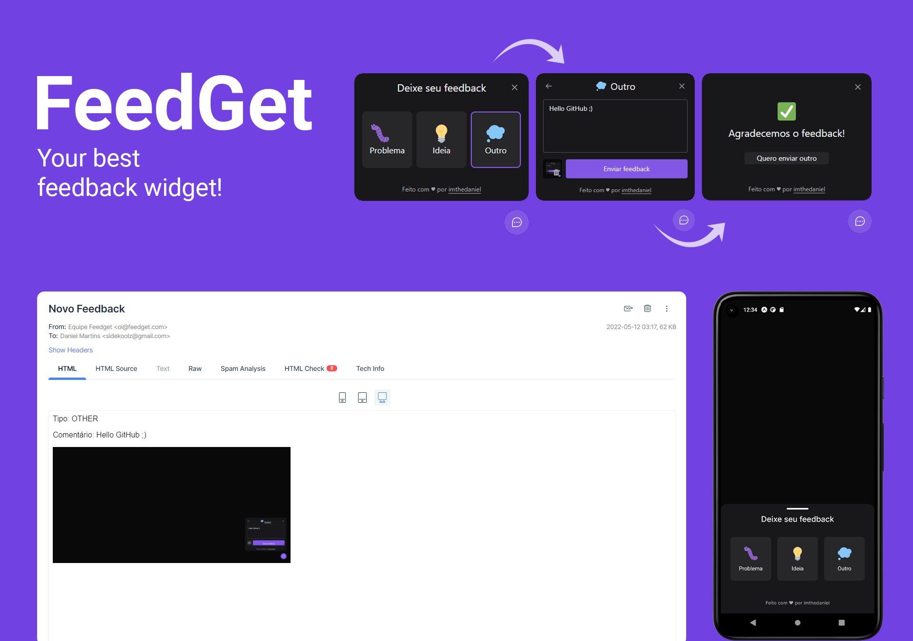

<h1 align="center">
  
</h1>

<p align="center">
  <a href="#-projeto">Projeto</a>&nbsp;&nbsp;&nbsp;|&nbsp;&nbsp;&nbsp;
  <a href="#-tecnologias">Tecnologias</a>&nbsp;&nbsp;&nbsp;|&nbsp;&nbsp;&nbsp;
  <a href="#-features">Features</a>&nbsp;&nbsp;&nbsp;|&nbsp;&nbsp;&nbsp;
  <a href="#-layout">Layout</a>&nbsp;&nbsp;&nbsp;|&nbsp;&nbsp;&nbsp;
  <a href="#-executando-o-projeto">Executando o projeto</a>&nbsp;&nbsp;&nbsp;|&nbsp;&nbsp;&nbsp;
  <a href="#memo-licença">Licença</a>
</p>

<p align="center">
 

  
</p>

<br>

<p align="center">
  <a href="https://nlw-return-impulse-tawny-rho.vercel.app/" target="_blank">Clique aqui</a> para acessar a versão web
</p>

## ✨ Projeto

FeedGet se trata de um widget para envio de feedbacks, desenvolvido para ser utilizado em quaisquer outras aplicações, possibilita ao usuário o envio de uma sugestão, ideia ou até mesmo um bug, não só em texto, mas também com uma captura automática de tela.

## 🚀 Tecnologias

Esse projeto foi desenvolvido com as seguintes tecnologias:

<table border="0">
 <tr>
<td> HTML</td>
<td> CSS</td>
<td> JavaScript</td>
<td> React.JS</td>
<td> React Native</td>
<td> NodeJS</td>
<td> Prisma</td>
<td> Express</td>
 </tr>
 <tr>
<td>SQLite</td>
<td> PostgreSQL</td>
<td> Expo</td>
<td> TypeScript</td>
<td> Vite</td>
<td> Phosphor Icons</td>
<td> Axios</td></td>
<td> Jest</td>
 </tr>
</table>

## 🌟 Features

-   [ ] Autenticação Social OAuth2 com servidor do Discord.
-   [ ] Obtém perfil do usuário cadastro no Discord (username e avatar);
-   [ ] Lista os servidores do Discord que o usuário faz parte;
-   [ ] Permite realizar o agendamento de partidas;
-   [ ] Permite filtrar as partidas por categoria;
-   [ ] Exibe se a partida foi agendada em um servidor próprio (anfitrião) ou em servidores de outros (convidado);
-   [ ] Compartilha o convite para ingressar no servidor do usuário;
-   [ ] Permite redirecionar o usuário para o seu próprio servidor;
-   [ ] Disponibiliza a função de Logout.

## 🎨 Layout

Você pode visualizar o layout do projeto através [desse link](https://www.figma.com/community/file/1009821158959690135/Roquet.q). É necessário ter conta no [Figma](https://figma.com) para acessá-lo.

## 👨🏻‍💻 Executando o projeto

Utilize o **yarn** ou o **npm install** para instalar as dependências do projeto.
Em seguida, inicie o projeto.

```cl
expo start
```

Lembre-se de criar o seu App no servidor do Discord para obter as credencias de autenticação. Em seguida, defina no arquivo .env as configurações do seu App (remova o example do arquivo .env.example).
 
 ```cl
REDIRECT_URI=
SCOPE=
RESPONSE_TYPE=
CLIENT_ID=
CDN_IMAGE=
```

## :memo: Licença

Esse projeto está sob a licença MIT. Veja o arquivo [LICENSE](.github/LICENSE.md) para mais detalhes.

---
